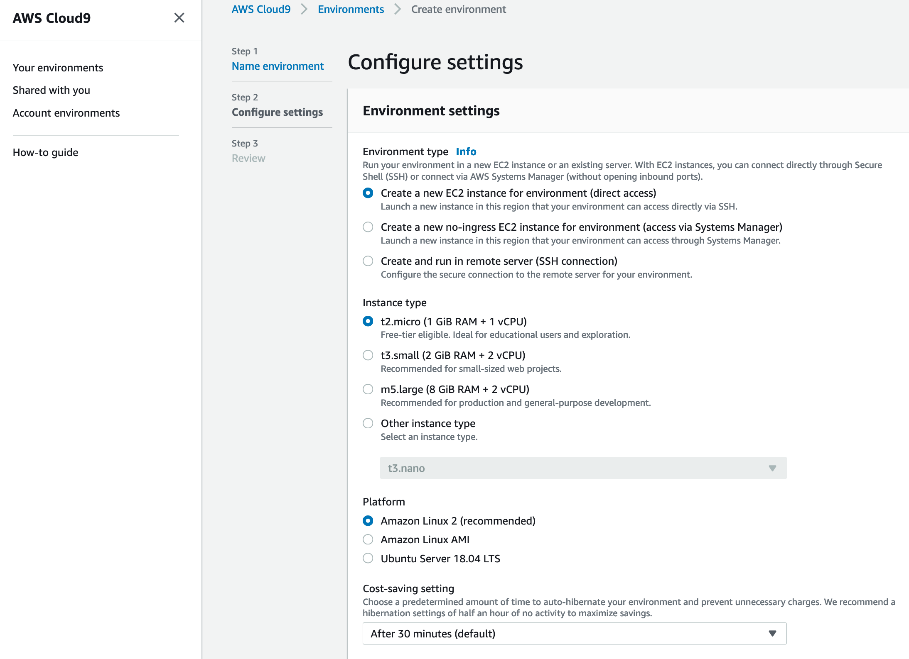

# How to deploy your Quarkus application to Amazon EKS

This project contains the supporting code for the "How to deploy your Quarkus application to Amazon EKS" blog post.

# Getting started

To build and deploy this application, you will need the AWS CLI, AWS CDK, Git, Maven, Amazon Corretto 17, kubectl, Apache Maven, Quarkus, and Docker. AWS Cloud9 makes the setup easy. AWS Cloud9 is a cloud-based integrated development environment (IDE) that lets you write, run, and debug your code with just a browser. It comes with the AWS tools, Git, and Docker installed.
Create a new [AWS Cloud9 EC2 environment](https://docs.aws.amazon.com/cloud9/latest/user-guide/create-environment-main.html) based on Amazon Linux. Because the compilation process with GraalVM is very memory intensive, it is recommended to select an instance with at least 8 GiB of RAM (for example, m5.large).



Launching the AWS Cloud9 environment from the AWS Management Console, you select the instance type. Pick an instance type with at least 8 GiB of RAM.
After creation, you are redirected automatically to your AWS Cloud9 environment’s IDE. You can navigate back to your IDE at any time through the [AWS Cloud9 console](https://signin.aws.amazon.com/signin?redirect_uri=https%3A%2F%2Fconsole.aws.amazon.com%2Fcloud9%2Fhome%3Fstate%3DhashArgs%2523%26isauthcode%3Dtrue&client_id=arn%3Aaws%3Aiam%3A%3A015428540659%3Auser%2Fcloud9&forceMobileApp=0&code_challenge=C-AufLUePBN22yMIphjlu96ObOBadc9Z0hK3poSCveQ&code_challenge_method=SHA-256).
All code blocks in this blog post refer to commands you enter into the terminal provided by the AWS Cloud9 IDE. AWS Cloud9 executes the commands on an underlying EC2 instance. If necessary, you can open a new Terminal in AWS Cloud9 by selecting *Window → New Terminal*.
Modify the [EBS volume](https://docs.aws.amazon.com/AWSEC2/latest/UserGuide/requesting-ebs-volume-modifications.html#modify-ebs-volume) of the AWS Cloud9 EC2 instance to at least 20 GB to have enough space for the compilation of your application. Then, reboot the instance using the following command in the AWS Cloud9 IDE terminal, and wait for the AWS Cloud9 IDE to automatically reconnect to your instance.

```
$ sudo reboot
```

Now we have to install [SDKMAN!](https://sdkman.io/). With SDKMAN! it is possible to manage parallel versions of multiple software development kits on most Unix-based systems.

```
$ curl -s "https://get.sdkman.io" | bash
$ source "/home/ec2-user/.sdkman/bin/sdkman-init.sh
```

With SDKMAN! we install Amazon Corretto 17, Apache Maven, and Quarkus CLI:

```
$ sdk install java 17.0.4-amzn
$ sdk install maven
$ sdk install quarkus
```

Now we validate the installation of the different SDKs and tools:

```
$ java -version
openjdk version "17.0.4" 2022-07-19 LTS
OpenJDK Runtime Environment Corretto-17.0.4.8.1 (build 17.0.4+8-LTS)
OpenJDK 64-Bit Server VM Corretto-17.0.4.8.1 (build 17.0.4+8-LTS, mixed mode, sharing)

$ mvn -version
Apache Maven 3.8.6 (84538c9988a25aec085021c365c560670ad80f63)
Maven home: /home/ec2-user/.sdkman/candidates/maven/current
Java version: 17.0.4, vendor: Amazon.com Inc., runtime: /home/ec2-user/.sdkman/candidates/java/17.0.4-amzn
Default locale: en_US, platform encoding: UTF-8
OS name: "linux", version: "4.14.287-215.504.amzn2.x86_64", arch: "amd64", family: "unix"

$ quarkus --version
2.12.3.Final
```

The next step is to install the latest AWS CDK Toolkit globally using the following Node Package Manager command.

```
$ npm install -g aws-cdk
```

Download and install the kubectl binary for your Kubernetes version 1.22 from Amazon S3 using the following commands:

```
$ curl -o kubectl https://s3.us-west-2.amazonaws.com/amazon-eks/1.22.6/2022-03-09/bin/linux/amd64/kubectl
$ chmod +x ./kubectl
$ mkdir -p $HOME/bin && cp ./kubectl $HOME/bin/kubectl && export PATH=$PATH:$HOME/bin
$ echo 'export PATH=$PATH:$HOME/bin' >> ~/.bashrc
```


# Contributing

Please create a new GitHub issue for any feature requests, bugs, or documentation improvements.

Where possible, please also submit a pull request for the change.
